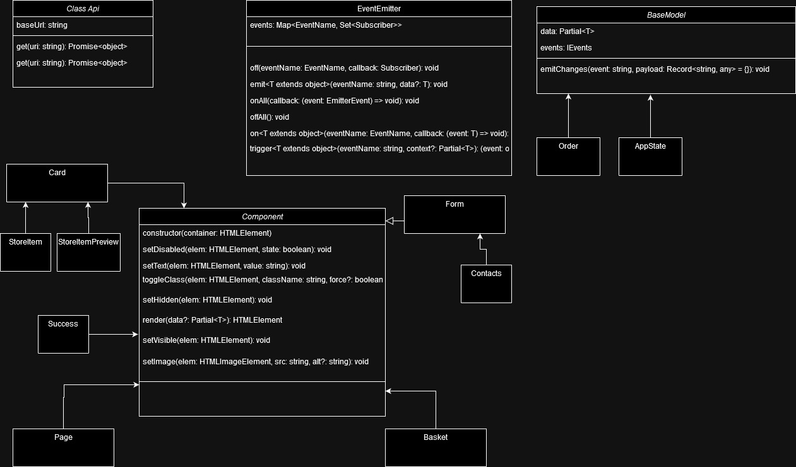

## README
https://github.com/Vonshirg/web-larek-frontend.git

# Проектная работа "Веб-ларек"

Это приложение состоит из нескольких компонентов, которые управляют и отображают элементы в интернет-магазине. Оно написано на TypeScript и разработано для модульности и расширяемости. Основные компоненты включают `Api`, `EventEmitter`, `Card`, `StoreItem`, `StoreItemPreview`, `Page`,`Basket`, `CartItem`, `AppState`,`Order`.

## Содержание

1. [Установка](#установка)
2. [Использование](#использование)
3. [Компоненты](#компоненты)
    - [Card](#card)
    - [StoreItem](#storeitem)
    - [StoreItemPreview](#storeitempreview)
    - [Page](#page)
    - [AppState](#appstate)
    - [Component](#component)
    - [Form](#form)
    - [Order](#order)
    - [Contacts](#contacts)
    - [Success](#success)
    - [Basket](#basket)
    - [CartItem](#cartitem)
    - [Api](#api)
    - [EventEmitter](#eventemitter)
    - [BaseModel](#basemodel)
4. [Основные типы данных](#основные-типы-данных)
5. [UML схема](#uml-схема)

## Установка

Для установки зависимостей и настройки проекта выполните:

```sh
npm install
```

## Использование

Для запуска сервера разработки выполните:

```sh
npm run start
```

Для сборки проекта для продакшена выполните:

```sh
npm run build
```

## Компоненты

### Card

Класс `Card` представляет отдельную карточку продукта.

#### Свойства

- `id: string` - Идентификатор карточки.
- `price: number | null` - Цена карточки.
- `category: CategoryType` - Категория карточки.
- `title: string` - Заголовок карточки.
- `image: string` - URL изображения карточки.
- `selected: boolean` - Выбрана ли карточка или нет.

#### Методы

- `constructor(container: HTMLElement, actions?: IClickMouseEvent)` - Инициализирует новую карточку.
- `set id(value: string)` - Устанавливает идентификатор карточки.
- `get id(): string` - Возвращает идентификатор карточки.
- `set price(value: number | null)` - Устанавливает цену карточки.
- `set category(value: CategoryType)` - Устанавливает категорию карточки.
- `set title(value: string)` - Устанавливает заголовок карточки.
- `get title(): string` - Возвращает заголовок карточки.
- `set image(value: string)` - Устанавливает изображение карточки.
- `set selected(value: boolean)` - Устанавливает состояние выбора карточки.

### StoreItem

Класс `StoreItem` расширяет `Card` и представляет элемент магазина.

#### Методы

- `constructor(container: HTMLElement, actions?: IClickMouseEvent)` - Инициализирует новый элемент магазина.

### StoreItemPreview

Класс `StoreItemPreview` расширяет `Card` и представляет предварительный просмотр элемента магазина.

#### Свойства

- `description: HTMLElement` - Описание элемента.

#### Методы

- `constructor(container: HTMLElement, actions?: IClickMouseEvent)` - Инициализирует новый предварительный просмотр элемента.
- `set descriptionText(value: string)` - Устанавливает текст описания.

### Page

Класс `Page` управляет элементами страницы, включая корзину и магазин.

#### Свойства

- `counter: number` - Счетчик товаров в корзине.
- `store: HTMLElement[]` - Элементы магазина.
- `locked: boolean` - Заблокирована ли страница.

#### Методы

- `constructor(container: HTMLElement, events: IEvents)` - Инициализирует новую страницу.
- `set lock(value: boolean)` - Устанавливает состояние блокировки страницы.
- `set count(value: number)` - Устанавливает значение счетчика корзины.
- `set store(items: HTMLElement[])` - Устанавливает элементы магазина.

### AppState

Класс `AppState` управляет состоянием приложения, включая список продуктов, корзину и текущий заказ.

#### Свойства

- `products: IProduct[]` - Список продуктов.
- `cart: IProduct[]` - Товары в корзине.
- `currentOrder: IOrder` - Текущий заказ.
- `validationErrors: FormErrors` - Ошибки валидации формы заказа.

#### Методы

- `constructor(events: IEvents)` - Инициализирует состояние приложения с переданными событиями.
- `removeProductFromCart(productId: string): void` - Удаляет товар из корзины по его идентификатору.
- `updateOrderItems(): void` - Обновляет список товаров в текущем заказе.
- `calculateTotalCartPrice(): number` - Рассчитывает общую стоимость товаров в корзине.
- `deselectAllProducts(): void` - Снимает выделение со всех продуктов.
- `addProductToCart(product: IProduct): void` - Добавляет товар в корзину.
- `updateOrderField(field: keyof IOrderForm, value: string): void` - Обновляет поле текущего заказа.
- `clearCart(): void` - Очищает корзину.
- `getCartItemCount(): number` - Возвращает количество товаров в корзине.
- `validateOrderForm(): boolean` - Проверяет форму заказа на наличие ошибок.
- `setProducts(items: IProduct[]): void` - Устанавливает список продуктов.
- `resetOrder(): void` - Сбрасывает текущий заказ.

### Component

Абстрактный класс `Component` является базовым для всех компонентов.

#### Свойства

- `container: HTMLElement` - Контейнер для компонента.

#### Методы

- `constructor(container: HTMLElement)` - Инициализирует компонент с переданным контейнером.
- `setDisabled(elem: HTMLElement, state: boolean): void` - Устанавливает состояние "disabled" для элемента.
- `setText(elem: HTMLElement, value: string): void` - Устанавливает текстовое содержимое элемента.
- `toggleClass(elem: HTMLElement, className: string, force?: boolean): void` - Переключает класс на элементе.
- `setHidden(elem: HTMLElement): void` - Скрывает элемент.
- `render(data?: Partial<T>): HTMLElement` - Рендерит компонент с новыми данными.
- `setVisible(elem: HTMLElement): void` - Отображает элемент.
- `setImage(elem: HTMLImageElement, src: string, alt?: string): void` - Устанавливает изображение для элемента .

### Form

Класс `Form` управляет формой и ее состоянием.

#### Свойства

- `submitButton: HTMLButtonElement` - Кнопка отправки формы.
- `errorDisplay: HTMLElement` - Элемент для отображения ошибок.

#### Методы

- `constructor(container: HTMLFormElement, events: IEvents)` - Инициализирует форму.
- `set valid(isValid: boolean)` - Устанавливает состояние валидности формы.
- `set errors(errorMessages: string)` - Устанавливает сообщения об ошибках.
- `handleInputChange(event: Event): void` - Обрабатывает изменения в полях формы.
- `handleFormSubmit(event: Event): void` - Обрабатывает отправку формы.
- `render(state: Partial<T> & FormState): HTMLElement` - Рендерит форму с новым состоянием.
- `onInputChange(field: keyof T, value: string): void` - Обрабатывает изменения в полях формы.

### Order

Класс `Order` расширяет `Form` и управляет формой заказа.

#### Свойства

- `elements: IOrderFormElements` - Элементы формы заказа.

#### Методы

- `constructor(container: HTMLFormElement, events: IEvents)` - Инициализирует форму заказа.
- `disableButtons(): void` - Отключает активность кнопок.

### Contacts

Класс `Contacts` расширяет `Form` и управляет формой контактов.

#### Методы

- `constructor(container: HTMLFormElement, events: IEvents)` - Инициализирует форму контактов.

### Success

Класс `Success` управляет отображением успешного завершения заказа.

#### Свойства

- `closeButton: HTMLButtonElement` - Кнопка закрытия.
- `descriptionElement: HTMLElement` - Элемент для отображения описания.

#### Методы

- `constructor(container: HTMLElement, actions?: IClickMouseEvent)` - Инициализирует компонент.
- `set description(value: number)` - Устанавливает описание.

### Basket

Класс `Basket` управляет корзиной.

#### Свойства

- `elements: IComponentElements` - Элементы корзины.

#### Методы

- `constructor(container: HTMLElement, events: IEvents)` - Инициализирует корзину.
- `set list(items: HTMLElement[])` - Устанавливает список элементов.
- `set price(price: number)` - Устанавливает цену.
- `disableButton(): void` - Отключает кнопку.
- `refreshIndices(): void` - Обновляет индексы элементов списка.

### CartItem

Класс `CartItem` представляет элемент корзины.

#### Свойства

- `elements: IComponentElements` - Элементы корзины.

#### Методы

- `constructor(container: HTMLElement, actions?: IClickMouseEvent)` - Инициализирует элемент корзины.
- `set title(value: string)` - Устанавливает заголовок.
- `set price(value: number)` - Устанавливает цену.
- `set index(value: number)` - Устанавливает индекс.

### Api

Класс `Api` предназначен для взаимодействия с API и выполнения HTTP-запросов.

#### Свойства

- `baseUrl: string` - Базовый URL для запросов.
- `options: RequestInit` - Настройки запросов.

#### Методы

- `constructor(baseUrl: string, options: RequestInit = {})` - Инициализирует API с базовым URL и настройками запросов.
- `protected handleResponse(response: Response): Promise<object>` - Обрабатывает ответ от сервера.
- `get(uri: string): Promise<object>` - Выполняет GET-запрос.
- `post(uri: string, data: object, method: ApiPostMethods = 'POST'): Promise<object>` - Выполняет POST, PUT или DELETE запрос.

### EventEmitter

Класс `EventEmitter` реализует интерфейс `IEvents` и представляет брокера событий, предоставляющего возможности подписки и эмиссии событий.

#### Свойства

- `_events: Map<EventName, Set<Subscriber>>` - Карта событий и их подписчиков.

#### Методы

- `constructor()` - Инициализирует экземпляр `EventEmitter`.
- `on<T extends object>(eventName: EventName, callback: (event: T) => void): void` - Устанавливает обработчик на событие.
- `off(eventName: EventName, callback: Subscriber): void` - Снимает обработчик с события.
- `emit<T extends object>(eventName: string, data?: T): void` - Инициирует событие с данными.
- `onAll(callback: (event: EmitterEvent) => void): void` - Подписывается на все события.
- `offAll(): void` - Сбрасывает все обработчики.
- `trigger<T extends object>(eventName: string, context?: Partial<T>): (event: object) => void` - Создает триггер, который генерирует событие при вызове.


### BaseModel

Абстрактный класс `BaseModel` предназначен для работы с моделью данных и эмиссии событий при изменении данных.

#### Свойства

- `data: Partial<T>` - Данные модели.
- `events: IEvents` - Экземпляр `EventEmitter` для управления событиями.

#### Методы

- `constructor(data: Partial<T>, events: IEvents)` - Инициализирует модель с данными и экземпляром событий.
- `emitChanges(event: string, payload: Record<string, any> = {}): void` - Эмитирует событие с данными.

## Основные типы данных

- [CategoryType](#categorytype)
- [ICard](#icard)
- [IPage](#ipage)
- [IOrder](#iorder)
- [IPageElements](#ipageelements)
- [IOrderFormElements](#iorderformelements)
- [FormErrors](#formerrors)
- [IAppState](#iappstate)
- [FormState](#formstate)
- [IOrderForm](#iorderform)
- [IComponentElements](#icomponentelements)
- [IBasket](#ibasket)
- [IClickMouseEvent](#iclickmouseevent)
- [IProductBasket](#iproductbasket)
- [IProduct](#iproduct)


### CategoryType

```typescript
/**
 * Перечисление категорий товаров.
 */
export enum CategoryType {
  OTHER = 'другое',
  SOFT_SKILL = 'софт-скил',
  ADDITIONAL = 'дополнительное',
  BUTTON = 'кнопка',
  HARD_SKILL = 'хард-скил'
}
```

### ICard

```typescript
/**
 * Интерфейс карточки продукта.
 */
export interface ICard {
  id: string;
  title: string;
  category: string;
  description: string;
  image: string;
  price: number | null;
  selected: boolean;
}
```

### IPage

```typescript
/**
 * Интерфейс страницы магазина.
 */
export interface IPage {
  counter: number;
  store: HTMLElement[];
  locked: boolean;
}
```

### IOrder

```typescript
/**
 * Интерфейс заказа.
 */
export interface IOrder {
  items?: string[];
  payment?: string;
  total?: number | null;
  address?: string;
  email?: string;
  phone?: string;
}
```

### IPageElements

```typescript
/**
 * Интерфейс элементов страницы магазина.
 */
export interface IPageElements {
  counter: HTMLElement;
  wrapper: HTMLElement;
  basket: HTMLElement;
  store: HTMLElement;
}
```

### IOrderFormElements

```typescript
/**
 * Интерфейс элементов формы заказа.
 */
export interface IOrderFormElements {
  card: HTMLButtonElement;
  cash: HTMLButtonElement;
}
```

### FormErrors

```typescript
/**
 * Тип ошибок формы заказа.
 */
export type FormErrors = Partial<IOrderForm>;
```

### IAppState

```typescript
/**
 * Интерфейс состояния приложения.
 */
export interface IAppState {
  basket: IProduct[];
  store: IProduct[];
  order: IOrder;
  formErrors: FormErrors;
  manageBasket: {
    addToBasket(value: IProduct): void;
    deleteFromBasket(id: string): void;
    clearBasket(): void;
    getBasketAmount(): number;
    getTotalBasketPrice(): number;
    setItems(): void;
  };
  setOrderField(field: keyof IOrderForm, value: string): void;
  validateContacts(): boolean;
  validateOrder(): boolean;
  refreshOrder(): boolean;
  setStore(items: IProduct[]): void;
  resetSelected(): void;
}
```

### FormState

```typescript
/**
 * Тип состояния формы.
 */
export type FormState = {
  valid: boolean;
  errors: string[];
};
```

### IOrderForm

```typescript
/**
 * Интерфейс формы заказа.
 */
export interface IOrderForm {
  payment: string;
  address: string;
  email: string;
  phone: string;
}
```

### IComponentElements

```typescript
/**
 * Интерфейс элементов компонента.
 */
export interface IComponentElements {
  listElement?: HTMLElement; 
  indexElement?: HTMLElement; 
  titleElement?: HTMLElement; 
  priceElement: HTMLElement; 
  buttonElement: HTMLButtonElement;
}
```

### IBasket

```typescript
/**
 * Интерфейс корзины.
 */
export interface IBasket {
  list: HTMLElement[];
  price: number;
}
```

### IClickMouseEvent

```typescript
/**
 * Интерфейс события клика мыши.
 */
export interface IClickMouseEvent {
  onClick: (event: MouseEvent) => void;
}
```

### IProductBasket

```typescript
/**
 * Интерфейс товара в корзине.
 */
export interface IProductBasket extends IProduct {
  id: string;
  index: number;
}
```

### IProduct

```typescript
/**
 * Интерфейс продукта.
 */
export interface IProduct {
  id: string;
  description: string;
  image: string;
  title: string;
  category: CategoryType;
  price: number | null;
  selected: boolean;
}
```

## UML схема
