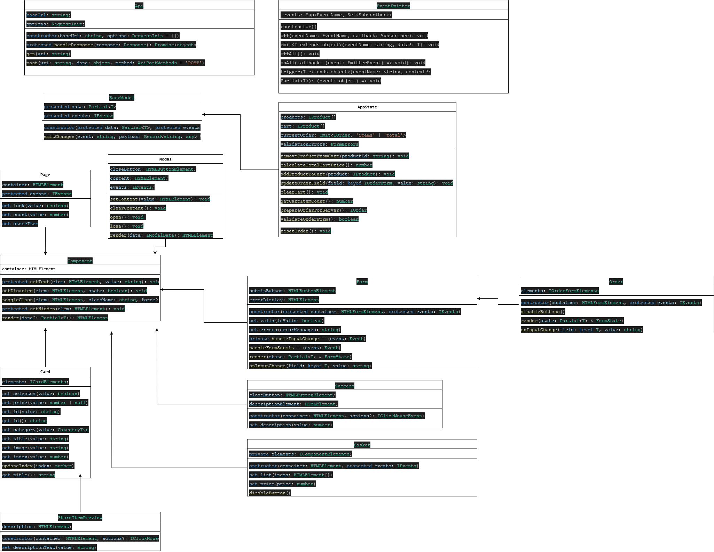

## README
https://github.com/Vonshirg/web-larek-frontend.git

# Проектная работа "Веб-ларек"

Это приложение состоит из нескольких компонентов, которые управляют и отображают элементы в интернет-магазине. Оно написано на TypeScript и разработано для модульности и расширяемости. Основные компоненты включают `Api`, `EventEmitter`, `Card`, `StoreItem`, `StoreItemPreview`, `Page`,`Basket`, `CartItem`, `AppState`,`Order`.

## Содержание

1. [Установка](#установка)
2. [Использование](#использование)
3. [Компоненты](#компоненты)
    - [Card](#card)
    - [StoreItemPreview](#storeitempreview)
    - [Page](#page)
    - [AppState](#appstate)
    - [Component](#component)
    - [Form](#form)
    - [Order](#order)
    - [Success](#success)
    - [Basket](#basket)
    - [Api](#api)
    - [EventEmitter](#eventemitter)
    - [BaseModel](#basemodel)
    - [Modal](#modal)
4. [Основные типы данных](#основные-типы-данных)
5. [uml](#дополнительное задание)

## Установка

Для установки зависимостей и настройки проекта выполните:

```sh
npm install
```

## Использование

Для запуска сервера разработки выполните:

```sh
npm run start
```

Для сборки проекта для продакшена выполните:

```sh
npm run build
```
### Основные компоненты архитектуры проекта

 **Основные части архитектуры проекта**:
    - **Данные**: Управление состоянием приложения и данными о продуктах, корзине и заказах (`AppState`).
    - **Отображения**: Компоненты, отображающие продукты, формы, модальные окна и другие элементы интерфейса (`Card`, `StoreItemPreview`, `Page`, `Modal`, `Order`, `Basket`).
    - **Работа с сервером**: Выполнение HTTP-запросов для взаимодействия с сервером (`Api`).

**Взаимодействие частей**:
    В приложении применен принцип MVP (Model-View-Presenter), который обеспечивает четкое разделение ответственностей между классами Model, View и Presenter.
    Примеры взаимодействия классов:

    Пользователь открывает карточку товара:
        Пользователь взаимодействует с интерфейсом, нажимая на карточку товара.
        Класс Card отвечает за отображение карточки товара на странице и реагирует на события пользователя, такие как клики, так как на элементы карточки повешаны слушатели.
        При клике на карточку товара вызывается метод descriptionText класса StoreItemPreview, который изменяет  описание товара в превью. После клика отображается модальное окно с помощью метода render класса Modal.

    Добавление товара в корзину:
        Пользователь нажимает на кнопку "Добавить в корзину" на карточке товара.
      При добавлении товара в корзину  происходит следующее:

        В методе handleCardToBasket проверяется, есть ли уже выбранный товар в корзине. Если товара нет в корзине, то он добавляется.
        Если товар был успешно добавлен в корзину, обновляется количество товаров в корзине (page.count), чтобы отобразить актуальное количество товаров в корзине.
        Затем модальное окно закрывается с помощью метода modal.close(), чтобы пользователь мог продолжить просмотр товаров или оформить заказ.
        После добавления товара в корзину обновляется информация о корзине. Это включает в себя обновление цены корзины (basket.price) и обновление списка товаров в корзине (appData.addProductToCart(item)). Также обновляется количество товаров в корзине (page.count).

    Ввод данных для заказа:
        Пользователь вводит данные для заказа в модальном окне в инпуты, такие как адрес доставки, телефон и выбирает способ оплаты. Ввод данных проверяется за счет метода validateOrderForm класса AppState.
       Информация о текущем заказе и введенные данные хранятся в объекте appdata управляемого классом AppState.

    Отправка заказа:
        Пользователь нажимает на кнопку "Оплатить" в модальном окне и срабатывает событие contacts:submit. Метод prepareOrderForServer() подготавливает данные заказа для отправки на сервер. Возвращаемые данные содержат информацию о выбранных товарах, адресе доставки и контактных данных пользователя.
        Метод post(uri: string, data: object) класса Api отправляет запрос на сервер для размещения заказа. Он принимает URI эндпоинта и данные заказа.
        Метод emit(event: string, data?: any) (Класс EventEmitter) генерирует событие "order:success" после успешной отправки заказа на сервер. Он передает данные о заказе в качестве аргумента.
        Метод disableButtons()(Order) отключает кнопки на форме заказа после успешного размещения заказа.
        Свойство count(Page) устанавливается в 0 после успешного размещения заказа. Вероятно, это используется для обновления счетчика товаров в корзине на странице.
    
**Компоненты приложения**:
    - Компоненты приложения

 включают в себя:
    - **Card**: Отображение карточки продукта.
    - **StoreItemPreview**: Предварительный просмотр элемента магазина.=
    - **Page**: Управление элементами страницы, такими как магазин и корзина.=
    - **Form**: Управление формами и их состоянием.
    - **Order**: Управление формой заказа.
    - **Success**: Отображение успешного завершения заказа.
    - **Basket**: Управление корзиной.
    - **Api**: Работа с сервером.
    - **AppState**: представляет компонент для управления состоянием всего приложения.
    - **Modal**: Работа с модальными окнами.
    -**Component**: предоставляет методы для управления элементами интерфейса, такие как изменение текста, переключение классов, установка изображений и рендеринг компонента.
    - **EventEmitter**: реализует события и обрабатывает их(например клики, изменения данных).
    - **BaseModel**: Абстрактный класс `BaseModel` предназначен для работы с моделью данных.
  
**Реализация процессов в приложении**:
    - Процессы в приложении реализованы через события с использованием класса `EventEmitter`.
    - Обработка событий, таких как клики и изменения данных, осуществляется с помощью подписки на события и вызова соответствующих методов.

## Описание событий

// Обработчик события изменения списка товаров
items:changed

// Обработчик события выбора карточки товара
card:select

// Обработчик события добавления товара в корзину
card:toBasket

// Обработчик события удаления товара из корзины
basket:delete

// Обработчик события оформления заказа
basket:order

// Обработчик события изменения ошибок формы заказа
orderFormErrors:change

// Обработчик события изменения ошибок формы контактов
contactsFormErrors:change

// Обработчик события изменения поля формы заказа
orderInput:change

// Обработчик события отправки формы заказа
order:submit

// Обработчик события открытия корзины
basket:open

// Обработчик события отправки формы контактов
form:submit

// Обработчик события закрытия модального окна
modal:close

// Обработчик события успешного оформления заказа
events.on('order:success', handleOrderSuccess);

## Компоненты

### Card

Класс `Card` Класс Card представляет собой компонент для отображения карточки товара в интерфейсе. Он наследует функционал базового компонента Component и добавляет специфичные методы и свойства для работы с карточкой товара.

#### Свойства

- `elements: ICardElements;` - Объес с основными элементами карточки.


#### Методы
    set selected(value: boolean)
        Устанавливает состояние "выбран" для карточки товара.
        Принимает значение типа boolean.

    set price(value: number | null)
        Устанавливает цену товара.
        Принимает значение типа number или null.

    set id(value: string)
        Устанавливает идентификатор товара.
        Принимает значение типа string.

    set category(value: CategoryType)
        Устанавливает категорию товара.
        Принимает значение типа CategoryType.

    set title(value: string)
        Устанавливает заголовок карточки товара.
        Принимает значение типа string.

    set image(value: string)
        Устанавливает изображение товара.
        Принимает значение типа string - ссылку на изображение.

    set index(value: number)
        Устанавливает индекс товара.
        Принимает значение типа number.


### StoreItemPreview

Класс `StoreItemPreview` класс StoreItemPreview расширяет функционал класса Card для предварительного просмотра элемента магазина. Он добавляет возможность установки текста описания товара.

#### Свойства

- `description: HTMLElement` - Описание элемента.

#### Методы

- `constructor(container: HTMLElement, actions?: IClickMouseEvent)` - Инициализирует новый предварительный просмотр элемента.
- `set descriptionText(value: string)` - Устанавливает текст описания.

### Page

Класс `Page` представляет собой компонент для отображения главной страницы приложения. Он наследует функционал базового компонента Component и добавляет специфичные методы и свойства для работы с элементами страницы.

#### Свойства

- `elements: IPageElements;` - Массив из html элементов страницы.

#### Методы

    set lock(value: boolean)
        Устанавливает состояние блокировки страницы.
        Принимает значение типа boolean.

    set count(value: number)
        Устанавливает счетчик товаров в корзине.
        Принимает значение типа number.

    set storeItem(items: HTMLElement[])
        Устанавливает элементы магазина на странице.
        Принимает массив элементов типа HTMLElement.

### AppState

Класс `AppState` представляет объект для управления состоянием всего приложения, включая информацию о продуктах, корзине, текущем заказе и валидации формы заказа. 

#### Свойства

    products: IProduct[] - массив продуктов в магазине.
    cart: IProduct[] - массив продуктов в корзине.
    currentOrder: Omit<IOrder, 'items' | 'total'> - текущий заказ без списка товаров и общей суммы.
    validationErrors: FormErrors - объект содержащий ошибки валидации формы заказа.

#### Методы

    removeProductFromCart(productId: string): void
        Удаляет продукт из корзины по его идентификатору.

    calculateTotalCartPrice(): number
        Вычисляет общую сумму товаров в корзине.

    addProductToCart(product: IProduct): void
        Добавляет продукт в корзину.

    updateOrderField(field: keyof IOrderForm, value: string): void
        Обновляет поле в текущем заказе и проверяет валидность формы заказа.

    clearCart(): void
        Очищает корзину.

    getCartItemCount(): number
        Возвращает количество товаров в корзине.

    validateOrderForm(): boolean
        Проверяет валидность заполненной формы заказа и сохраняет ошибки валидации.

    setProducts(items: IProduct[]): void
        Устанавливает продукты в магазине и отправляет событие об изменении списка продуктов.

    prepareOrderForServer(): IOrder
        Подготавливает заказ для отправки на сервер, включая список товаров и общую сумму.

    resetOrder(): void
        Сбрасывает текущий заказ до пустого состояния.
        Примечания

    Класс AppState играет ключевую роль в управлении данными и состоянием всего приложения, включая управление продуктами, корзиной и заказом.
    Он также отвечает за валидацию данных формы заказа и подготовку заказа для отправки на сервер.

### Component

Абстрактный класс Component<T> является базовым классом для компонентов интерфейса (Card, Basket, Form, Page, Success). Он предоставляет методы для управления элементами интерфейса, такие как изменение текста, переключение классов, установка изображений и рендеринг компонента. 

#### Свойства

- `container: HTMLElement` - Контейнер для компонента.

#### Методы

    setDisabled(elem: HTMLElement, state: boolean): void
        Устанавливает атрибут disabled для элемента elem в зависимости от значения state.

    setText(elem: HTMLElement, value: string): void
        Устанавливает текстовое содержимое элемента elem равным value.

    toggleClass(elem: HTMLElement, className: string, force?: boolean): void
        Переключает класс className для элемента elem. Если параметр force задан, то класс будет добавлен, если force равен true, и удален, если force равен false.

    render(data?: Partial<T>): HTMLElement
        Рендерит компонент, применяя переданные данные data к свойствам класса. Возвращает контейнер компонента.

    setImage(elem: HTMLImageElement, src: string, alt?: string): void
        Устанавливает изображение для элемента elem с указанным источником src. Если указан альтернативный текст alt, устанавливает его для изображения.

        Примечания

    Класс Component<T> предоставляет базовые методы для работы с элементами интерфейса и управления их состоянием.
    Он может быть использован в качестве базового класса для различных компонентов интерфейса, обеспечивая им общий набор методов для работы с DOM.

### Form

Класс `Form`  обеспечивает управление состоянием формы, включая валидацию, обработку ошибок и обработку событий ввода.

#### Свойства

    valid: boolean
        Устанавливает состояние валидности формы. Если true, разрешает отправку формы, если false, блокирует кнопку отправки.

    errors: string
        Устанавливает сообщения об ошибках для отображения в форме.

#### Методы

    render(state: Partial<T> & FormState): HTMLElement
        Рендерит форму с учетом переданного состояния state.
        Обновляет состояние валидности и сообщения об ошибках.
        Возвращает контейнер формы.

    onInputChange(field: keyof T, value: string): void
        Обработчик события ввода. Генерирует событие orderInput:change с информацией о поле и его значении.

Приватные методы

    handleInputChange(event: Event): void
        Обработчик события ввода. Обновляет состояние формы при изменении значений полей.

    handleFormSubmit(event: Event): void
        Обработчик события отправки формы. Предотвращает отправку формы по умолчанию и генерирует событие submit.
        
### Order

Класс `Order` расширяет `Form` и управляет формой заказа. Он добавляет дополнительные элементы и обработчики событий для выбора способа оплаты.

#### Свойства

elements: IOrderFormElements - Элементы формы заказа.

#### Методы

    disableButtons(): void
        Отключает активность кнопок выбора способа оплаты.

### Success

Класс Success представляет собой компонент для отображения сообщения об успешном завершении заказа. Он наследуется от компонента Component<{ description: number }> и предоставляет метод для установки описания успешного завершении заказа.

#### Свойства

- `closeButton: HTMLButtonElement` - Кнопка закрытия.
- `descriptionElement: HTMLElement` - Элемент для отображения описания.

#### Методы

    constructor(container: HTMLElement, actions?: IClickMouseEvent)
        Создает новый экземпляр компонента.
        Принимает container - HTML-элемент, в который будет встроен компонент, и actions - объект с обработчиками событий.
        Инициализирует переменные closeButton и descriptionElement, представляющие кнопку закрытия и элемент описания успешного действия соответственно.
        Добавляет обработчик события на кнопку закрытия, если переданы действия и кнопка доступна.

set description(value: number)` -     Устанавливает описание успешного действия.
    Задает текстовое содержимое элемента descriptionElement, отображая списание указанной суммы синапсов в формате Списано [цена] синапсов..

### Basket

Класс Basket представляет собой компонент для отображения корзины товаров. Он наследуется от компонента Component<IBasket> и предоставляет методы для установки списка товаров, общей стоимости корзины, а также отключения кнопки заказа.

#### Свойства

elements: IComponentElements - Элементы корзины.

#### Методы

    list: HTMLElement[]
        Устанавливает список товаров в корзине.
        Заменяет текущие элементы списка новыми элементами и отключает кнопку заказа, если список пуст.
    price: number
        Устанавливает общую стоимость корзины.
        Устанавливает текстовое содержимое элемента, отображая общую стоимость в формате Стоимость: [цена] синапсов.
    disableButton()
        Отключает кнопку заказа, делая ее неактивной.

#### Функция
 formatPrice предоставляет утилиту для форматирования цены товаров.

    formatPrice(price: number): string
        Принимает price - цену товара в виде числа.
        Возвращает отформатированную строку цены с разделителями разрядов, если цена больше 1000.

### Api

Класс `Api` предназначен для взаимодействия с API и выполнения HTTP-запросов.

#### Свойства

baseUrl: string - Базовый URL для запросов.
options: RequestInit - Настройки запросов.

#### Методы

   get(uri: string): Promise<object>
        Выполняет GET-запрос к указанному URI.
        Принимает uri - URI ресурса.
        Возвращает промис, разрешаемый в объект с данными ответа от сервера.
    post(uri: string, data: object, method: ApiPostMethods = 'POST'): Promise<object>
        Выполняет POST-запрос к указанному URI с переданными данными.
        Принимает uri - URI ресурса, data - данные для отправки и необязательный параметр method, определяющий метод запроса (по умолчанию 'POST').
        Возвращает промис, разрешаемый в объект с данными ответа от сервера.

    protected handleResponse(response: Response): Promise<object>
        Обрабатывает ответ от сервера.
        Принимает объект response типа Response.
        Возвращает промис, разрешаемый в объект с данными ответа от сервера или отклоняемый с ошибкой в случае неудачного запроса.

### EventEmitter

Класс `EventEmitter` реализует интерфейс `IEvents` и представляет брокера событий, предоставляющего возможности подписки и эмиссии событий.

#### Свойства

    _events: Map<EventName, Set<Subscriber>>
        Хранит отображение имени события на множество обработчиков этого события.

#### Методы

    constructor()
        Создает новый экземпляр класса EventEmitter.
    on<T extends object>(eventName: EventName, callback: (event: T) => void): void
        Устанавливает обработчик на событие.
    off(eventName: EventName, callback: Subscriber): void
        Снимает обработчик с события.
    emit<T extends object>(eventName: string, data?: T): void
        Инициирует событие с данными.
    onAll(callback: (event: EmitterEvent) => void): void
        Устанавливает обработчик для всех событий.
    offAll(): void
        Снимает все обработчики событий.
    trigger<T extends object>(eventName: string, context?: Partial<T>): (data: T) => void
        Создает триггер, который генерирует событие при вызове.


### BaseModel

Абстрактный класс `BaseModel` предназначен для работы с моделью данных и эмиссии событий при изменении данных.

#### Свойства

    data: Partial<T>
        Частичное представление данных модели.
    events: IEvents
        Экземпляр класса EventEmitter, предоставляющий функции для работы с событиями.

#### Методы

    emitChanges(event: string, payload: Record<string, any> = {}): void
        Эмитирует событие с указанным именем и данными в виде объекта payload.

## Основные типы данных

- [CategoryType](#categorytype)
- [ICard](#icard)
- [IPage](#ipage)
- [IOrder](#iorder)
- [IPageElements](#ipageelements)
- [IOrderFormElements](#iorderformelements)
- [FormErrors](#formerrors)
- [IAppState](#iappstate)
- [FormState](#formstate)
- [IOrderForm](#iorderform)
- [IComponentElements](#icomponentelements)
- [IBasket](#ibasket)
- [IClickMouseEvent](#iclickmouseevent)
- [IProductBasket](#iproductbasket)
- [IProduct](#iproduct)


### CategoryType

```typescript
/**
 * Перечисление категорий товаров.
 */
export enum CategoryType {
  OTHER = 'другое',
  SOFT_SKILL = 'софт-скил',
  ADDITIONAL = 'дополнительное',
  BUTTON = 'кнопка',
  HARD_SKILL = 'хард-скил'
}
```

### ICard

```typescript
/**
 * Интерфейс карточки продукта.
 */
export interface ICard {
  id: string;
  title: string;
  category: string;
  description: string;
  image: string;
  price: number | null;
  selected: boolean;
}
```

### IPage

```typescript
/**
 * Интерфейс страницы магазина.
 */
export interface IPage {
  counter: number;
  store: HTMLElement[];
  locked: boolean;
}
```

### IOrder

```typescript
/**
 * Интерфейс заказа.
 */
export interface IOrder {
  items?: string[];
  payment?: string;
  total?: number | null;
  address?: string;
  email?: string;
  phone?: string;
}
```

### IPageElements

```typescript
/**
 * Интерфейс элементов страницы магазина.
 */
export interface IPageElements {
  counter: HTMLElement;
  wrapper: HTMLElement;
  basket: HTMLElement;
  store: HTMLElement;
}
```

### IOrderFormElements

```typescript
/**
 * Интерфейс элементов формы заказа.
 */
export interface IOrderFormElements {
  card: HTMLButtonElement;
  cash: HTMLButtonElement;
}
```

### FormErrors

```typescript
/**
 * Тип ошибок формы заказа.
 */
export type FormErrors = Partial<IOrderForm>;
```

### IAppState

```typescript
/**
 * Интерфейс состояния приложения.
 */
export interface IAppState {
  basket: IProduct[];
  store: IProduct[];
  order: IOrder;
  formErrors: FormErrors;
  setOrderField(field: keyof IOrderForm, value: string): void;
  validateContacts(): boolean;
  validateOrder(): boolean;
  refreshOrder(): boolean;
  setStore(items: IProduct[]): void;
  resetSelected(): void;
}
```

### FormState

```typescript
/**
 * Тип состояния формы.
 */
export type FormState = {
  valid: boolean;
  errors: string[];
};
```

### IOrderForm

```typescript
/**
 * Интерфейс формы заказа.
 */
export interface IOrderForm {
  payment: string;
  address: string;
  email: string;
  phone: string;
}
```

### IComponentElements

```typescript
/**
 * Интерфейс элементов компонента.
 */
export interface IComponentElements {
  listElement?: HTMLElement; 
  indexElement?: HTMLElement; 
  titleElement?: HTMLElement; 
  priceElement: HTMLElement; 
  buttonElement: HTMLButtonElement;
}
```

### IBasket

```typescript
/**
 * Интерфейс корзины.
 */
export interface IBasket {
  list: HTMLElement[];
  price: number;
}
```

### IClickMouseEvent

```typescript
/**
 * Интерфейс события клика мыши.
 */
export interface IClickMouseEvent {
  onClick: (event: MouseEvent) => void;
}
```

### IProductBasket

```typescript
/**
 * Интерфейс товара в корзине.
 */
export interface IProductBasket extends IProduct {
  index: number;
}
```

### IProduct

```typescript
/**
 * Интерфейс продукта.
 */
export interface IProduct {
  id: string;
  description: string;
  image: string;
  title: string;
  category: CategoryType;
  price: number | null;
}
```

## UML схема
